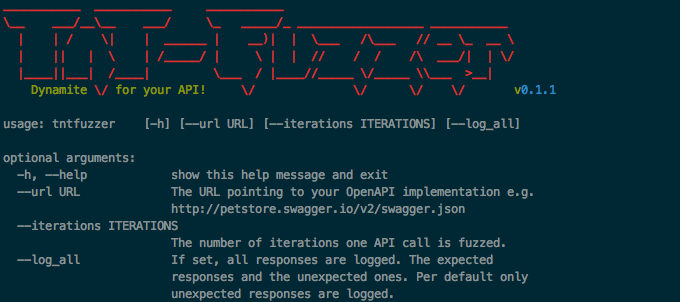

============
OpenAPI (swagger) fuzzer written in python. This fuzzer is like dynamite for your API!

TnT-Fuzzer is designed to make fuzzing, robustness testing and validation of REST APIs easy and maintainable. After a 
fuzzing run, the log files state the exact history of requests to reenact a crash or misuse. TnT-Fuzzer can be used 
for penetration testing or continued testing of a service in development.  

## Installation
TnT-Fuzzer needs **python 2.7**

### With pip
Just install tntfuzzer with pip and its ready for usage:

```
pip install tntfuzzer
```

### From source
Checkout git repository. Navigate into fresh cloned repository and install all dependencies needed. All dependencies 
are listed in requirements.txt and can be installed via pip:

```
pip install -r requirements.txt
```

Then run **tntfuzzer** with:

```
python tntfuzzer/tntfuzzer.py
```

## Documentation

### Examples

To get a better hang what can be done with tntfuzzer, print the usage infos:

```
tntfuzzer -h
```



The most important parameter is the **--url**, with the URL to your OpenAPI specification json file. 

The parameter **--iterations** will specifiy how often an API call will be fuzzed. If 
the **--iterations** parameter is not specified, every API call is fuzzed only once.

Per default only responses that are not documented in your Service's OpenAPI specification are logged. This way only 
undocumented errors are logged. If you want all fuzz responses to be logged, you have to specify that by 
setting the **--log_all** parameter. 

So following example run will fuzz every API call specified in the swagger.json with 100 permutations each. All 
responses received from the server are logged: 
```
tntfuzzer --url http://example.com:8080/v2/swagger.json --iterations 100 --log_all
```

### Log

When run, TnT-Fuzzer logs all responses in a table on commandline: 

| operation | url | response code | response message | response body | curl command |
|---|---|---|---|---|---|
| get       | http://localhost:8080/v2/apicall | 200 | Successful Operation | {'success': true} | ```curl -XGET -H "Content-type: application/json" -d '{'foo': bar}' 'http://localhost:8080/v2/apicall'``` |

### Testing

For testing or development, have a look at the [swagger petstore example](http://petstore.swagger.io/). A local stub 
server can easily be generated and run locally. 

Run software tests using the following command:

```
$ nosetests ./tests/*.py
........................
----------------------------------------------------------------------
Ran 24 tests in 0.028s

OK
```
 
